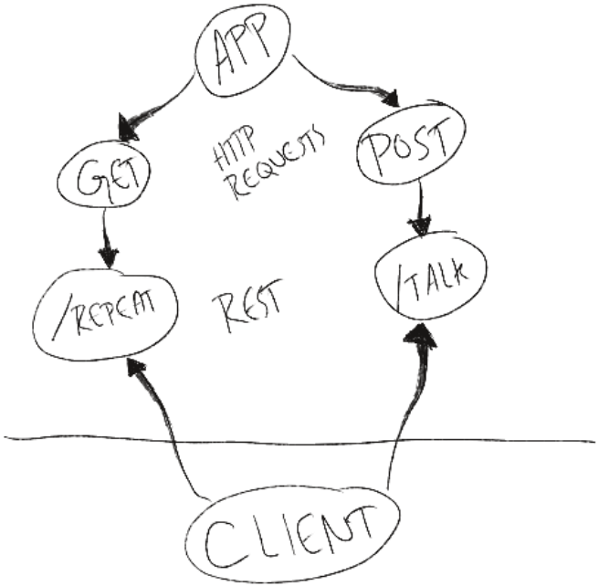

# Express Server

Created by Justin Hamerly

## Installation

* Dependencies: dotenv, express, jest, supertest\
* install with npm install

## Summary of Problem Domain

* Build a server that can successfully be deployed to Heroku.

## Links

[DEV TESTING HEROKU SERVER](https://justin-server-deploy-dev.herokuapp.com/)\
[PRODUCTION HEROKU SERVER](https://justin-server-deploy-prod.herokuapp.com/)\
[GITHUB](https://github.com/JustinHamerly/server-deployment-practice/tree/dev)

## UML

## Routes

* HTTP GET
  * Path: /repeat
    * responds with the last string used in post route `/talk`.

* HTTP POST
  * Path: /talk
    * Accepts a string.
    * responds with a string in all caps.
